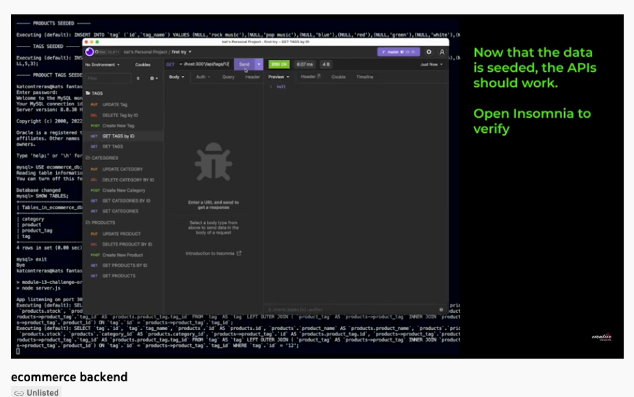

<h1 align="center">E-commerce Back End 🚀 </h1>

 
## Description
A backend app to help manage an ecommerce site.  APIs for products, categories, tags and IDs. 

## Table of Contents
- [Description](#description)
- [Installation](#installation)
- [Usage](#usage)
- [License](#license)
- [Contributing](#contributing)
- [Tests](#tests)
- [Questions](#questions)
## Installation
go to root directory and run 'npm start' Mysql shell to create schema and seed the data.  [View tutorial](https://www.youtube.com/watch?v=KTwt1fA2OPM)
## Usage
Used to manage and access the backend of an ecommerce site.
## License

 
This application is covered by the MIT license. 
## Contributing
Kat Contreras
## Tests
no
## Questions
email us at kat.contreras@gmail.com 
 
:octocat: Find us on GitHub: [katcontrerasdev](https://github.com/katcontrerasdev)  
 
Email me with any questions: kat.contreras@gmail.com  
  
